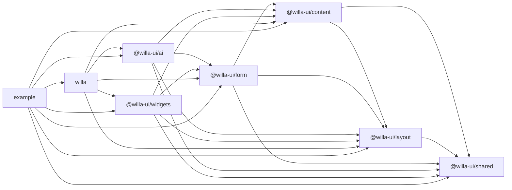
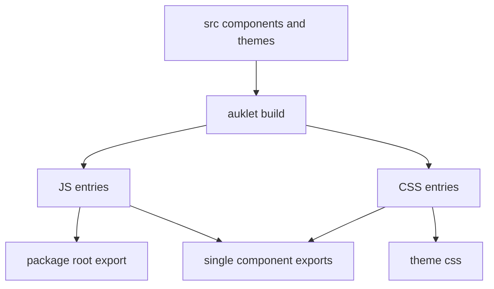
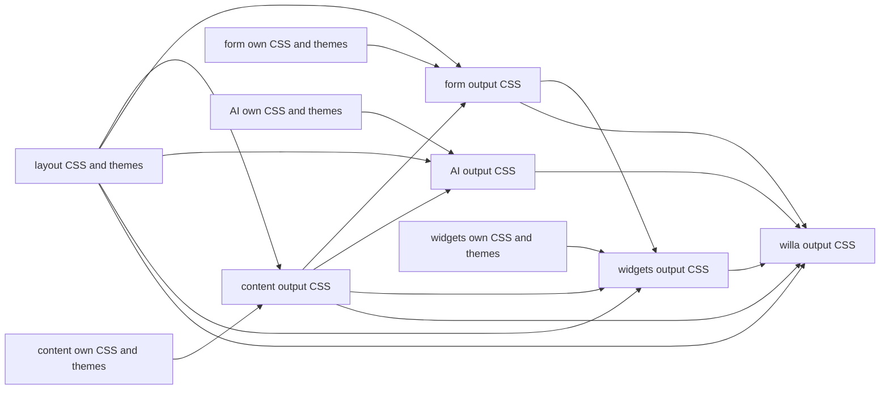
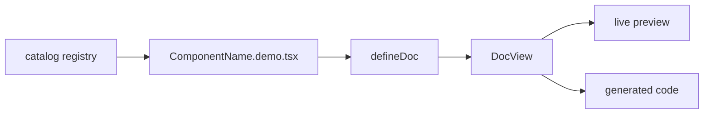

# Willa Architecture

This document records Willa's repository structure, module responsibilities,
dependency relationships, build flow, and common pitfalls. For new components,
see [Willa Component Guide](./component.md). For CSS and theme rules, see
[Willa CSS Guide](./css.md). For code style, see
[Willa Style Guide](./style.md).

## Project Scope

Willa is a React component library for AI products, blogs, documentation sites,
content platforms, MDX pages, and rich interactive content rendering. The core
requirements are:

- Components can be imported from package root entries.
- Components can be imported from single-component entries.
- Component CSS can be composed per component.
- Light and dark theme CSS can be composed across packages.
- Product interaction components and content rendering components can be
  combined without crossing package ownership boundaries.
- The example app can consume source code directly for development and docs.

The repository is a pnpm workspace monorepo. Packages are built with `auklet`.

## File Organization

```text
.
  package.json
  pnpm-workspace.yaml
  tsconfig.json
  CONTRIBUTING.md
  docs/
    architecture.md
    component-roadmap.md
    component.md
    css.md
    style.md
  example/
    src/
      catalog/
      docs/
  packages/
    willa/
      src/
      auklet.config.mjs
    willa-content/
      src/
        components/
        themes/
      auklet.config.mjs
    willa-layout/
      src/
        components/
        themes/
      auklet.config.mjs
    willa-form/
      src/
        components/
        themes/
      auklet.config.mjs
    willa-ai/
      src/
        components/
        themes/
      auklet.config.mjs
    willa-widgets/
      src/
        components/
        themes/
      auklet.config.mjs
    willa-shared/
      src/
      auklet.config.mjs
```

The root directory contains workspace configuration, shared TypeScript
configuration, repository documentation, and development commands. Packages do
not maintain their own `tsconfig.json`; they use the root `tsconfig.json`.

`docs` contains focused maintenance documents:

- `architecture.md`: overall structure, module relationships, build flow, and
  pitfalls.
- `component-roadmap.md`: component roadmap and future AI product component
  planning.
- `component.md`: component creation, migration, exports, and example rules.
- `css.md`: CSS, theme variables, and cross-package style dependency rules.
- `style.md`: TypeScript, React, and documentation code style.

## Module Responsibilities

`packages/willa` is the public aggregate package, published as `willa`. It
exports aggregate components and does not export `@willa-ui/shared`. It usually
does not own component implementations or theme variables; it combines selected
layout, content, form, AI, and widgets outputs. AI components are implemented
in `@willa-ui/ai`, then exposed through `willa` for public use.

`packages/willa-content` is the base product and content component package,
published as `@willa-ui/content`. It contains general product and content
components such as `Button`, `CodeBlock`, `Callout`, `Image`, `Tabs`,
`Dialog`, and `Steps`.

`packages/willa-layout` is the layout component package, published as
`@willa-ui/layout`. It contains layout primitives such as `Card`, `Group`,
`Stack`, `Grid`, `Masonry`, `Container`, `Panel`, `Separator`, `SplitPane`,
`ResizablePanel`, `PageHeader`, `SectionHeader`, `AppShell`, and
`SidebarLayout`. Layout components own their component-specific layout
variables and the Willa base visual tokens such as fonts, text colors, lines,
surfaces, and focus rings.

`packages/willa-form` is the form component package, published as
`@willa-ui/form`. It contains form controls and form layout components such as
`Input`, `TextArea`, `Select`, `Checkbox`, `Radio`, `Switch`, `DatePicker`,
`Upload`, `Form`, `FormField`, and `FormActions`. It can compose layout and
content components and reuse their CSS through `styles.dependencies`, but
layout and content must not depend on form.

`packages/willa-ai` is the AI product component package, published as
`@willa-ui/ai`. It contains AI-oriented scene components such as prompt inputs,
chat messages, source citations, tool call displays, generation cards, context
panels, and agent status views. It can compose layout and content components
and reuse their CSS through `styles.dependencies`, but it must not make layout
or content depend on AI.

`packages/willa-widgets` is the scenario component package, published as
`@willa-ui/widgets`. It contains platform integrations, MDX composition,
external embeds, media-rich content blocks, and more domain-specific components
such as `Mdx`, `GitHubRepo`, `XPostEmbed`, `WebEmbed`, `AudioEmbed`,
`VideoEmbed`, `Poem`, and `EnglishCards`. It can compose layout, content, and
form components, but layout, content, and form must not depend on widgets.

`packages/willa-shared` is the shared utility package, published as
`@willa-ui/shared`. It contains cross-package types, text utilities, node
utilities, clipboard helpers, and similar logic. It does not contain React
components or component CSS.

`example` is the component demo and documentation app. In development, it
consumes package source through tsconfig aliases. The default port is `2333`.

## Dependency Relationships

Dependencies must remain one-way:

- shared does not depend on content, form, AI, or widgets.
- content can depend on shared and layout.
- layout can depend on shared.
- form can depend on shared, layout, and content.
- ai can depend on shared, layout, content, and form when it composes form
  inputs.
- widgets can depend on shared, layout, content, and form.
- willa depends on layout, content, form, AI, and widgets as the public
  aggregate package.
- example can depend on all public packages and source aliases.

Do not make layout or content depend on form, AI, or widgets. Do not move
layout-specific, form-specific, AI-specific, or widget-specific variables,
styles, or components back into content.



## Path Aliases

Prefer source aliases over deep relative paths:

- `#content/*` points to `packages/willa-content/src/*`
- `#layout/*` points to `packages/willa-layout/src/*`
- `#form/*` points to `packages/willa-form/src/*`
- `#ai/*` points to `packages/willa-ai/src/*`
- `#widgets/*` points to `packages/willa-widgets/src/*`
- `#shared/*` points to `packages/willa-shared/src/*`
- `#example/*` points to `example/src/*`
- `@willa-ui/*` points to package source roots

`willa/*` maps to single-component entries under `packages/willa/src/*`. When
adding path rules, prefer wildcard mappings instead of one-off file mappings.

## Build Relationships

Every publishable package uses `auklet.config.mjs`. `modules: true` generates
single-component entries. `styles.themes` declares the package's own theme CSS.
`styles.dependencies` declares cross-package CSS dependencies.

Core build outputs include:

- Package root entries, such as `@willa-ui/content`.
- Single-component entries, such as `willa/CodeBlock`.
- Package root CSS, such as `willa/style.css`.
- Single-component CSS, such as `willa/CodeBlock.css`.
- Theme CSS, such as `willa/themes/light.css` and `willa/themes/dark.css`.



## CSS Composition Flow

CSS composition is driven by `styles.dependencies` in `auklet.config.mjs`.
Content, form, AI, and widgets depend on layout CSS for base visual tokens and
layout component styles. Form, AI, and widgets also depend on content CSS when
they compose content components. AI and widgets can also depend on form CSS
when they compose form components. willa composes public package CSS.



This means higher-level packages can reference base visual tokens from layout
and component variables from their direct CSS dependencies. They must not copy
layout or content variable definitions. willa only composes CSS and does not
own component theme variables.

## Example Documentation Flow

Example documentation data lives in `example/src/docs`. The registry lives in
`example/src/catalog/registry.ts`. `registry.ts` keeps lightweight entries and
loads demos dynamically through `load`, so component code and CSS do not all
enter the initial page.



## Pitfalls

- Do not make layout or content depend on form, AI, or widgets. Do not make form
  depend on AI or widgets. layout is the base visual layer, content is the base
  product/content layer, form is the form layer, and AI and widgets are scenario
  layers. Reversing this makes lower packages heavier and breaks
  single-component CSS composition.
- Do not copy layout or content variables into higher-level package themes.
  They already depend on upstream CSS and themes through
  `styles.dependencies`; duplicate definitions make theme sources inconsistent.
- Do not add component theme variables to the willa aggregate package. willa
  only combines public package CSS; component variables should follow the
  package that owns the component source.
- Do not add per-package `tsconfig.json` files. Current aliases, strict checks,
  and example source consumption depend on the root TypeScript config.
- Do not change `auklet.config.mjs` back to TypeScript. The current auklet
  version does not support `auklet.config.ts`; use `.mjs` and `defineConfig`.
- Do not validate only package root entries. New public components must verify
  package root imports, willa root imports, willa single-component imports, and
  single-component CSS imports.
- Do not make `registry.ts` statically import demos. Example demos should load
  only when selected.
- Portal component theme variables cannot live only on `.willa-shell`. For
  example, `Lightbox` renders into `document.body`, so the variable scope must
  also cover the component root.
